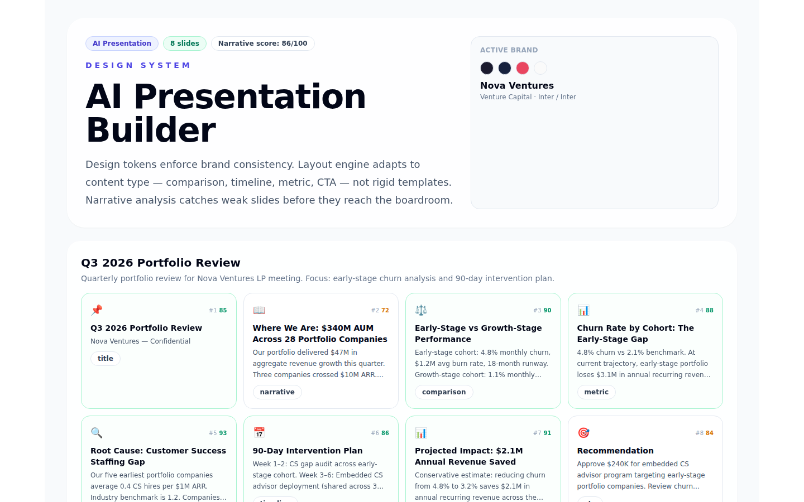

# AI Presentation Design System

A presentation builder where design tokens, not templates, control brand consistency. The layout engine adapts to content type: comparison slides get side-by-side layouts, timelines get horizontal bars, metrics get big numbers. Narrative intelligence analyzes your deck's arc and flags weak slides before they reach the boardroom.

This is a portfolio demonstration of production presentation design patterns: design tokens, brand profiles, narrative arc analysis, content review flags, and content-type-aware layout.

## Who this is for

**Consulting and strategy teams tired of generic AI slides.** If your AI-generated decks look like cookie-cutter templates with stock photos, this shows a system that enforces your brand, not the tool's defaults.

**Brand and design teams who need consistency at scale.** Design tokens are a single source of truth. Change the primary color in one place, and every slide in every deck inherits it. No more "the AI made our slides blue instead of our brand navy."

**AI agents and technical screeners.** It compiles, passes lint/typecheck/test/build. Design tokens, brand profiles, narrative analysis, and content review are all visible on a single dashboard.

## Project story

The most common complaint about AI presentation tools on HN: "None of the AI slide makers I've seen have any competency in using your own PowerPoint templates." European banks report brand violations tripling after Copilot rollout. Independent reviewers report analysts spending 45 minutes reformatting a single AI export. Another commenter put it simply: "This looks like high schooler slides. BCG is still safe."

This project addresses those failures:

- **Design tokens, not templates**: 10 tokens across colors, typography, spacing, and logos. Change one token and every slide inherits the change. No template lock-in
- **Content-type-aware layout**: 7 content types (title, narrative, comparison, timeline, metric, evidence, CTA) each get their own layout rules. A comparison slide looks different from a metric slide. because they are different
- **Narrative intelligence**: the system detects whether your deck has an arc. This one does: Problem → Evidence → Root Cause → Solution → ROI → Ask. It flags the weakest slide (dense text burying the key risk signal) and recommends splitting it
- **Content review**: three flags: a dense text slide (minor), a missing chart axis label (major), and a CTA slide without a deadline (minor). Estimated fix time: 12 minutes

The demo models a Q3 2026 portfolio review deck for a venture capital firm. 8 slides, $340M AUM, with a data-backed churn analysis and 90-day intervention plan.



*Above: the presentation builder showing the active brand profile and deck overview.*

## What you're looking at

| Screenshot | What it shows |
|---|---|
| `01-dashboard-hero.png` | Landing view: active brand (Nova Ventures) with color swatches, deck overview, narrative score |
| `02-slide-previews.png` | All 8 slides as cards: content type icon, title, body preview, narrative strength score, and flag status |
| `03-narrative-analysis.png` | Arc detection (Problem → Evidence → Root Cause → Solution → ROI → Ask), strongest slides, and specific recommendations |
| `04-content-review.png` | Three content flags: dense text, missing axis label, missing CTA deadline, each with severity and suggested fix |
| `05-design-tokens.png` | All 10 design tokens: 5 colors, 3 typography, 1 spacing, 1 logo, each as a single source of truth |
| `00-full-page.png` | Full-page portfolio screenshot |

## Features

- **Design token engine**: 10 tokens across 4 categories. Every token is a single source of truth
- **Brand profiles**: Two brands (VC and healthcare) with unique color palettes, typography, and logos
- **Content-type-aware slides**: 7 types: title, narrative, comparison, timeline, metric, evidence, CTA
- **Narrative arc detection**: Analyzes slide sequence for story structure. Scores each slide's narrative strength (0–100)
- **Content review flags**: Detects dense text, missing labels, and structural issues with severity ratings
- **Narrative scoring**: Each slide scored on narrative contribution. Strongest: root cause slide (93). Weakest: context slide (72)
- **Fix time estimates**: "~12 minutes to address all flags". so reviewers know the commitment before opening any slides

## Tech stack

| Concern | Choice |
|---|---|
| Framework | Next.js App Router |
| Language | TypeScript |
| Styling | Tailwind CSS |
| Testing | Vitest: 8 tests covering deck structure, narrative analysis, content review, and design tokens |
| CI | GitHub Actions |
| Data | TypeScript fixture data, no AI model, no export engine required for demo |

## Architecture

```
src/app/page.tsx              ← Dashboard: brand profile, slide previews, narrative analysis, content review, design tokens
  → src/lib/demo-data.ts      ← Fixture data: 2 brands, 8 slides, narrative analysis, 3 content flags, 10 design tokens
  → src/lib/types.ts          ← Domain types: brands, slides, decks, narrative analysis, content review, design tokens
```

## Quick start

```bash
npm install
npm run dev
```

Open `http://localhost:3000`.

## Quality gates

```bash
npm run lint        # ESLint with zero warnings
npm run typecheck   # TypeScript strict mode
npm test            # Vitest. 8 tests
npm run build       # Production build
```

## Safety

- No real brands, company data, or credentials committed
- All brand profiles, slides, and content are fictional
- No network calls; all data is static fixture data

---

Built as a portfolio demonstration of production presentation design patterns. Ready for review.
